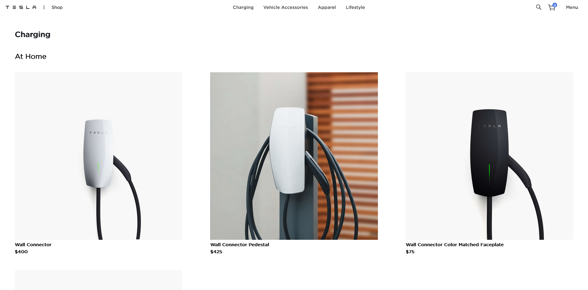
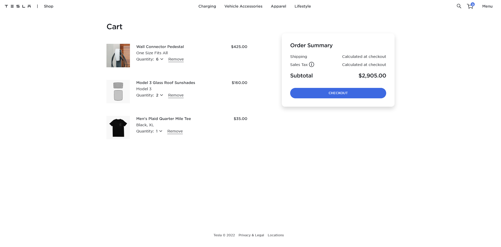
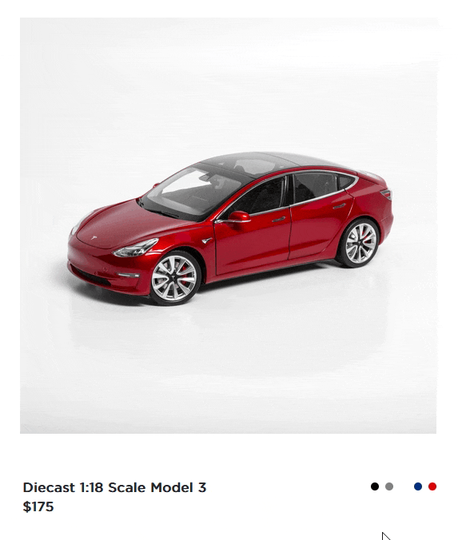

# Tesla Shop Clone - With React

I used react for this project for the pure purpose of practicing React.

[Checkout a hosted version here](https://endingnever.github.io/groupproject/)

## Table of contents

- [Authors](#authors)
- [Overview](#overview)
  - [The challenge](#the-challenge)
  - [Screenshot](#screenshot)
  - [Links](#links)
- [My process](#my-process)
  - [Built with](#built-with)
  - [What I learned](#what-i-learned)
  - [Useful resources](#useful-resources)

## Authors

- Andrew Schroepfer
  - [Website](https://syntheticdesigner.github.io/)
  - [Linkedin](https://www.linkedin.com/in/andrew-schroepfer/)
- Fabian Villasenor
  - [Website](https://github.com/EndingNever)
  - [Linkedin](https://www.linkedin.com/in/fabianvillasenor/)
- Tesfaye Robelle
  - [Website](https://github.com/tdebella)
  - [Linkedin](https://www.linkedin.com/in/tesfaye-robelle-4a2b7921a/)
- Eyerusalem Abebe
  - [Website](https://github.com/SalemAbebe)
  - [Linkedin](https://www.linkedin.com/in/eyerusalem-abebe-8858a495/)

## Overview

### The challenge

In 8 days with a group of four create/recreate a single-page multi-page react application. Must consist of at least 5 pages.

Our team chose the [shop.tesla](https://shop.tesla.com/) website.

Stretch Goals:
[x]Animate components.
[x]Create product color options
[x]Create product size options
[x]Create cart with redux
[x]Create checkout user flow
[ ]Add product data and user to mock database with firebase

### Screenshot






### Links

- Solution URL: [https://github.com/EndingNever/groupproject](https://github.com/EndingNever/groupproject)
- Live Site URL: [https://endingnever.github.io/groupproject/](https://endingnever.github.io/groupproject/)

## Our process

### Built with

- Semantic HTML5 markup
- CSS custom properties
- CSS Grid and Flex
- [SASS](https://sass-lang.com/)
- [React](https://reactjs.org/) - JS library
- [Styled Components](https://styled-components.com/)
- [React Router v6](https://reactrouter.com/)
- [React Responsive Carousel](https://github.com/leandrowd/react-responsive-carousel)
- [Redux](https://redux.js.org/) & [Redux Toolkit](https://redux-toolkit.js.org/)

We decided early on that we were going to create a set of data that we could use throughout the site. We discussed several different ways of structuring the data before deciding on a solution.

```javascript
let data = [
  {
    category,
    subCategory,
    products: [
      {
        itemImg,
        itemImgHover,
        itemName,
        itemPrice: integer || [low, high],
        subCategory,
        category,
        stockStatus,
        options: [],
        colors: [{ color, itemImg, itemImgHover }],
      },
    ],
  },
];
```

One of the most parts of this data was the options. We used it control many conditional properties of our products. Whether they had a quick add, or view details button, whether they had select size, or if they were a best seller, or if they had a subx2 (sub sub) category.

Of course now that we made our bed we had to lie in it. Some of the most interesting code we wrote was our method for interpreting the options. We would read the options and create an object with the options as the keys mapping the products to an array based on which options it had. We did this to resolve many items which would be in multiple subx2 categories.

```javascript
products.forEach((product) => {
  product.options.forEach((option) => {
    if (
      option !== "view-details" &&
      option !== "quick-add+" &&
      option !== "select-size"
    ) {
      setUseSubSubCategories(true);
      if (optionArraysObject[option]) {
        optionArraysObject[option] = [...optionArraysObject[option], product];
      } else {
        optionArraysObject[option] = [product];
      }
    }
  });
});
```

We used redux to build the cart. With redux toolkits entityAdapters we quickly made a list cart items and track the total cart value and quantity when a product is added or removed.

The floating nave hover effect was a enjoyable puzzle. After carefully inspecting the tesla website we used a very similar method to move an indicator div by passing its targets property values to it. We made use of the useRef hook and styled components props to change the indicators position rather then css var.

The method of creating our refs for the nav was interesting. We create a ref that then dynamically generated an array of refs inside of it rather than create each ref individually.

```javascript
const navRefs = useRef(navList.map(() => createRef()));

const mainNavLinks = navList.map((listItem, i) => (
  <li
    key={i}
    ref={navRefs.current[i]}
    onClick={() =>
      navigate(
        `category/${listItem.category.toLocaleLowerCase().replace(/\s/g, "-")}`
      )
    }
    onMouseEnter={() => handleEnter(navRefs.current[i].current, listItem)}
  >
    {listItem.category}
  </li>
));
```
